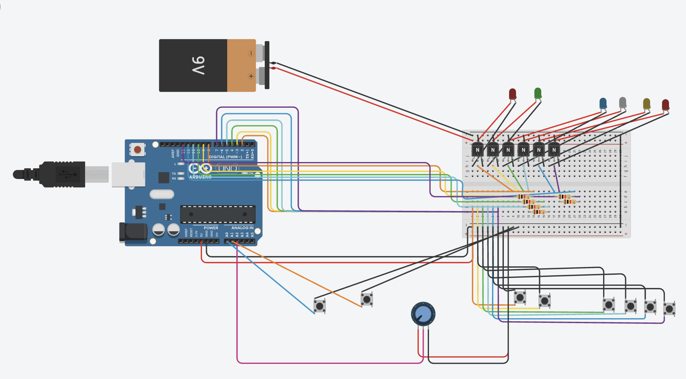

# 

Ruin the Show is an interactive exhibit that takes you behind the scenes of a game show as the producer, where you manage the lights and cameras to make the show run smoothly. Ruin the Show was also inspired by the 1950s Quiz Show Scandals, where producers would have certain contestants cheat in order to boost their ratings, so in Ruin the Show, you are also trying to cheat without getting caught - the more you successfully cheat, the higher your ratings go! 

[Visit our Website](https://ruintheshow.com)

## Meet the Team
Ruin the Show was created by a team of designers and developers from the Rochester Institute of Technology (RIT), partnering with the Strong Museum of Play as their Senior Capstones for New Media Design (BFA) and New Media Interactive Development (BS). 

| Designers                 | Developers    |
| --------                  | -------       |
| [Adi D.](https://www.linkedin.com/in/adi-das-01a200197/)         | [Blessing O.](https://www.linkedin.com/in/ugochinyereokogeri/)   |
| [Brandon R.](https://www.linkedin.com/in/brandon-riley-906794262/)    | [Kaiden T.](https://www.linkedin.com/in/kaiden-terrana/)     |
| [Cass K.](https://www.linkedin.com/in/casskress/)    | [Max C.](https://www.linkedin.com/in/maxwell-c-69714121b/)        |
| [Griffin P.](https://www.linkedin.com/in/griffin-paradee-7b0980218/)    |   |
| [Jaelin V.](https://www.linkedin.com/in/jaelin-vernon-926b17255/)     |   |
| [Lily K.](https://www.linkedin.com/in/lilykniseley25/)       |   |
| [Yohermry K.](https://www.linkedin.com/in/yohermrykpodo/)   |   |

## Implementation

<!-- clean image of the whole installation -->

We implemented the full exhibit at Imagine RIT on Saturday, April 26, 2025. From a technical and a design standpoint, the exhibit was a huge success. 

The program ran the length of the exhibition (8 hours) without errors, lag, or needing to be reset. The physical podium also lasted well throughout the day, only needing to adjust the smaller buttons once due to them getting accidentally dislodged from the button casing. 

Additionally, visitors of all ages stopped by and enjoyed the exhibit. The design and music drew people in to the room we were stationed in, and the game itself functioned well for individuals and larger groups (up to 6), so people could play by themselves or with family and/or friends. 

<!-- images of people having fun -->

Most notably, our exhibit was [featured on RIT's Instagram](https://www.instagram.com/p/DI670IuO3ti/?img_index=1) as the primary image for their campus-wide event. 

## Technical Overview

The system uses a Finite State Machine with an Event-Driven architecture to handle hardware input and control rendering.

### Software Used: 

* Node.js
* P5.js
* Arduino 

### Navigating the Repo 

    src
    ├── arduino         # Everything hardware-related
    │   ├── Panel       # Arduino code
    │   └── panel.js    # Connects the arduino & server
    ├── client          # Front-End related code
    │   ├── assets      # Images, videos, audio, and lighting 
    │   ├── sketch.js   # Rendering code 
    │   └── ...              
    ├── server          # Server-side code
    │   ├── game.js     # Controls the program via state machine
    │   └── index.js    # Initializes node server, routes GET and POST requests to alter the state machine
    └── ...
    

### Running the project

1. Install node and npm, if not already installed
2. Clone the repo
3. Run `npm i`
4. Connect the Arduino to your computer, and update `src/arduino/panel.js line:20` to be the correct port. 

    1. Note: You may run the project in "development mode", which uses keyboard controls in place of the Arduino. See `src/client/sketch.js line:5` for the keyboard controls. 
5. For a full installation, ensure Resolume Arena is open to the file `src/client/assets/lighting/ImagineRITxRTS.avc`and lights are connected. 
6. Run `npm test`
7. Open `localhost:3000` in your web browser

    1. Click the HTML button that appears. It will hide itself and ensure videos and audio are allowed to play. 

## Hardware

We used Arduino for the physical components, and SerialPort to connect it to Node. When a button is pressed (or other feature interacted with), an event is emitted and processed in the server. 

### Physical Construction

<!-- upload podium images -->

The podium was built out of wood, and using an Arduino Uno, 4 small LED buttons, 2 large arcade buttons, a custom lever (a potentiometer and a 3D-printed handle), and a joystick. 

The joystick may be substituted for another controller that exclusively moves horizontally. We used the joystick as it was readily available. 

The RFID scanner and accompanying wristbands were supplied by The Strong Museum of Play. 

Prototypes of the podium were built with cardboard, and while it was functional, would not have held up during the exhibition. The wood construction was extremely durable and held up well throughout the length of the exhibition and afterwards. The only issue we ran into was the height required smaller children to use a stepstool to effectively reach the buttons. 

### Panel.ino

This file processes input and output for the Arduino. It can be reached via `src/arduino/Panel/Panel.ino`.

`setup()` initializes all of the buttons and LEDs, turning off all LEDs to start. 

`loop()` reads the state of each interactable component, and sets a reference to the previous state. 

`processCommand(String command)` takes in a command, given from `panel.js`. It then parses what the command is, and turns on / off relevant LEDs, then prints an "acknowledged" response after it successfully executes the command. 

### Panel.js

This file executes and handles events between the server and the podium. It can be reached via `src/arduino/panel.js`. 

#### Events & Input Received 

In `serialSetup() ... serial.on('data', ...)`, different strings are received from `Panel.ino`. There are 3 different types of messages received: 

1. System Started ("Game Controller Initialized!")
2. Command From Server Acknowledged ("[...]ACK")
3. Component Interacted With ("CHEAT_PRESSED", "JOYSTICK_POSITION:", etc)

The first type of message starts the game, calling `game.awake()`. 

The second type is effectively ignored by the server. 

The third type of message sends commands to `game.js` depending on which message was received. Each message type has effectively the same implementation; sending an event to the server with any relevant information. 

#### Events & Output Given

This file also has public methods that control the state of the LEDs, that the server could access to turn on and off the LEDs as needed. 

#### Development Mode

During development, we created a flag to allow us to test the program without being connected to the Arduino. Errors will print to the console, but will not crash the program. 

## Server

As the backbone of this application, this part of the repository is responsible for the actual gameplay of Ruin the Show. The server is split into two files: `index.js` and `game.js`. 

### Index.js

This file sets up the express application, starts the node server, and handles GET and POST requests. It largely serves with the GET and POST requests as the connection between the back end and the front end, so must understand relevant information about the state of the application, and communicate this information. It can be reached at `src/server/index.js`. 

#### Setting up Express & Starting the Server

We are using Express for this project due to its ease and familiarity. It is used in this project to serve our assets and scripts to the client, and for routing. 

`app.listen(PORT, ...)` starts up the server at localhost at port 3000 (`localhost:3000`). From there, the application can be loaded and all functionality can occur. 

#### GET Requests 

`app.get('/', ...)` serves the client our `index.html` file, containing tags for p5.js and our client-side scripts. 

`app.get('/getState', ...)` communicates between the server and the client the current state of the game. It contains two parts: variables tied to the state of the game (`state`) and animation events that need to be triggered (`messages`). `state` pulls data from the `GameMachine.getState()` method in `src/server/game.js`, sending it to the client to update as needed. `messages` takes the `GameMachine.messages_for_frontend` array, sending that to the client, then clearing the array, assuming that the client handles any and all events it receives. More information on what both of these are and contain can be found below.  

#### POST Requests

We have a single POST request, and it is not particularly necessary for the application to function, but moreso a feature of the "Development Mode". This allows for testing and gameplay to occur with keyboard controls in place of or in addition to Arduino controls. We implemented this mode as a failsafe in the event of the hardware malfunctioning during the exhibition, and for developers to test remotely, without access to the hardware.

`app.post('/setState', ...)` was created so that the game state variables could be altered and updated from the client on a keypress, in addition to from the server on an Arduino button press. The POST request is written to expect two values in the body: `event` and `data`. `event` is a string that corresponds to an event name in the server (`'applause-button-pressed'`, `'rfid-scan'`, etc), particularly looking for an input-based event. If the string is not one of those events, or if the event is not a string at all, it returns early with a 400 status code. Otherwise, it adds the event to the queue of events, alongside any `data` that is sent along with it. `data` defaults to an empty object, and contains any relevant data for a given event (podium number, lever position, etc). More information about the event-driven architecture can be found below. 

### Game.js

This file is the main source of all state related variables and events. It can be reached at `src/server/game.js`. There are four main components of `game.js`:

1. Finite State Machine
2. Event Firing & Handling
3. Resolume OSC Outputs
4. RFID Integration

#### 1. Finite State Machine

The Finite State Machine (FSM) is the driving force of the entire application. The FSM is contained in the `GameMachine` class. 

`GameMachine.getState()` returns an object with data about the current state of the game that the client would need. This includes the users' score, the current scene (Idle, Onboarding, Playing, End), details about the host, any event cues, and event feedback.

`GameMachine.step()` is the primary section of this class, containing nested conditionals that fire events and handle fired events as needed. The top level conditionals are checking for what scene is active, secondary level conditionals are designated for relevant interactions - for example, when the game is in Idle, the user can only have two interactions; RFID scan, and Applause button pressed. There are conditionals for each of those events, and all other events are ignored. 

`GameMachine.run()` begins the game loop if it hasn't already been started. It does this by calling the `loop` function (containing a call to `GameMachine.step()`) repeatedly using `setImmediate()`.

`GameMachine.stop()` immediately stops the game loop that is created in `GameMachine.run()`, however it is unutilized in the codebase. 

`GameMachine.addEvent()` adds events to our `eventQueue` queue. Each event is an object containing a name (an enum) and a data object (defaulting to an empty object). This event is parsed in `GameMachine.step()`, and when it is processed, the event is dequeued using the `Array.shift()` function. 

We chose to implement the FSM structure since our game has multiple states with large blocks of code to be executed. The FSM pattern was the simplest way we found to avoid unnecessary checks, and increase performance. 

#### 2. Event Firing & Handling

In addition to the FSM, we implemented an event-driven architecture for the project. There are two types of events; game events (stored in `eventQueue`) and animation events (stored in `messages_for_frontend`).

`eventQueue` is the primary list used within the state machine. There are 2 main categories of events that are added to this queue, with each category as its own enum; game state altering events (`events`) and feedback-based events (`feedback`). 

The `events` enum has all of the events that relate to the state of the game. There are input-based events (`events.CHEAT_BUTTON_PRESSED`, `events.LEVER_MOVED`, etc) that are added to the queue when the hardware has been interacted with (emitted in `src/arduino/panel.js`), controller events (`events.TURN_ON_APPLAUSE`, `events.TURN_OFF_PODIUM`, etc) that are added to the queue on timers specific to each mechanic. There are also state-related events (`events.RETURN_IDLE`, `events.GAME_OVER`, etc) that are added to the queue on timers to control what the state of the game is, and alter the FSM. 

The `feedback` enum contains events for each mechanic, and whether the feedback the user should receive was positive (points gained, example: `feedback.APPLAUSE_GOOD`) or negative (points lost, example: `feedback.APPLAUSE_BAD`). These events are fired alongside the points changing, and primarily serve to trigger animation events.  

`messages_for_frontend` is a list that gets sent to the client in `src/server/index.js` through the `/getState` endpoint. Each message is an object that contains a `target` and a `name`: the `target` is which visual element is being animated (the host Al, the audience, etc), and the `name` is which animation should occur (idle, walkRight, walkLeft, etc). These messages are then parsed by the client, altering the target to run the named animation. 

We chose to use an event-driven architecture due to the nature of our interactions. We needed something that could communicate with many parties (server, client, hardware) when something happens, and events are able to do that most effectively. We also wanted to make sure the structure we chose allowed for multiple simultaneous interactions, as users could hit multiple buttons at the same time, since the gameplay encourages it. Putting our events in a queue like this meant they would each be processed in the order they occurred in. 

#### 3. Lighting OSC Outputs

The installation includes environmental lighting, which is also controlled through this section of the code. The lighting patterns are done through Resolume Arena, and the server sends OSC commands to the software on each cue. Within the Resolume file (`src/client/Assets/Lighting/ImagineRITxRTS.avc`), each lighting preset is organized by column, and named appropriately. 

The OSC client is initialized near the top of the file, using the Resolume default port of 7000. For the purposes of our installation, we have the connection running through the localhost address, thus Resolume would have to be open on the same computer in order for this to function properly. 

The commands are sent to Resolume via `GameMachine.sendOscCue(cueType)`. This method takes in which cue is being sent (of type `GameMachine.lighting`) and via switch statement dictates which lighting preset should be triggered. It then uses that to send the OSC command, triggering the specified column. If there was an invalid preset, or a new one that hadn't been accounted for through this function, it would return early, printing the invalid cue. 

We chose to use Resolume via OSC since we had worked with the software and method previously, and chose to implement each preset as a column due to its ease and adaptability. By sending whole columns, we could link multiple different outputs all with the same call, allowing us to have sound effects and different lighting all triggered at once. 

#### 4. RFID Integration

The last part of the server is integrating the RFID provided by The Strong Museum of Play. They requested we utilize their technology present in their LevelUp videogame exhibit into our exhibit design, so we incorporated the scanner into the podium, and provided wristbands for guests that they could use to interact with the game. 

Guests with an RFID wristband could scan their wristband to start the game. At scale, this would store the user's ID, and would add their final score to their cumulative score for the whole Beyond the Buzzer exhibit. They could also, if they did not receive a wristband, begin the game by pressing a button on the podium (the applause button). 

Additionally, for repeat visitors, they could tap their RFID band to skip the onboarding video. At scale this could be worked to use their user ID as well, checking if they have already played within the past hour before letting them skip the onboarding video, to avoid visitors accidentally skipping the video.

When users scan their RFID wristbands, the events are sent as an SSE event. In `awake()`, we create an event listener for the `tap` event, which adds the `GameMachine.events.RFID_SCAN` event to the `eventQueue`, and allows for the interactions stated. 

We also implemented custom lighting for the RFID scanner. We created several presets for the scanner in `RTSrfidPresets`, and trigger each one dependent on the state of the game. The presets are changed when cued, primarily on game-state changes. If there is an error in changing the lights, for example if the network is down momentarily, it waits for 2 seconds before trying to send the lighting change again. 

## Client

The client is broken up into 3 parts: 

1. p5.js rendering 
2. Assets
3. Static files

Each of these are things that are displayed to visitors visually in some regard, and are hosted and changed in the browser. 

### Sketch.js (p5.js Rendering)

This file is the primary interface the user sees. As such it is a lengthy file with a lot of complex pieces. This file would likely benefit from another refactor, pulling some of the complex pieces or helper functions out of the file, or other changes to improve readability. It can be found at `src/client/sketch.js` and is called through our `client/index.html` file. 

Below you can find information about: 

1. What is stored 
    1. State-affected Variables
    2. Rendering Variables
2. What is drawn
    1. Static Assets
    2. Simple Animations 
    3. Complex / Character Animations 
3. How they are drawn
    1. Graphics layers
    2. Scene by Scene
        1. Idle & Onboarding Scenes
        2. Main Game Scene
        3. Game Over Scene
4. Development Mode 
    1. Keyboard Controls

#### State-affected Variables

There are a number of variables that are tied to the state of the game - a full list can be found within the `RTSstate` object. Each of these affect a different aspect of what is being rendered. 

In `syncStateLoop()` we are polling the server every 50ms at the `/getState` endpoint, copying the old values to a `previousState` variable, then populating the state object with the new values. Additionally, if there are any animation cues that were sent, those would also be handled accordingly.

Each animation cue is handled through `changeAnimations()` which takes the message from the server. The message contains a `target` and a `name`, the `target` being the object to animate, the `name` corresponding to the name of the animation. It first splits up by `target`, then, if necessary, the `name`, to trigger the relevant animation.  

#### Rendering Variables

Not every variable that affects the front-end are affected by the server state. 

For example, the game timer that is displayed is independent from the internal timer (as that is a `setTimeout` rather than a variable). The timer presented to the visitor utilizes the `millis()` function, calculating the difference between the current time and the time the game began in `getTimeRemaining()`. This is then parsed into minute:second format, and displayed to the user in the UI in `drawCountdown()`. 

Additionally, the camera zoom is achieved through altering the source rectangle of the background layer (deeper explanation below). There are a number of variables associated with this, particularly because the values are lerped over a set time, to ensure smooth transitions. 

Other global variables present are for our assets, and information related to the asset.  

#### Static Assets

We generally organized our static assets by what scene they are for, and included relevant variables within the object, giving us 3 different objects related to static assets: `idleOnboarding`, combining the idle and onboarding scenes, `assets` holding the main game assets, and `end` holding the game over assets. Some assets in these objects are animated assets, and the animated assets are differentiated by being initialized with an object instead of an empty string. 

All of our assets are loaded in `window.preload`, regardless of type. With more time we may have looked into lazy loading of game and end state assets, as loading every asset on reload results in the page having slow load speed, however for the purposes of our installation, we only needed to load the page once at the start of the exhibition, and let it loop over the course of the day, so it was a nonissue. 

We are also loading our background audio through the same manner, storing the paths and ideal volume for each track in the `audio` object. Sound effects are given alongside lighting cues through Resolume Arena (more on that above). 

#### Simple Animations 

Our simple animations are the midway point between a static image and a spritesheet (like our more complex animations). Elements animated this way typically only have color, visibility, and/or position updated each frame.

For example, the spotlight on the host will appear and disappear on cues. Additionally, based on events received from the server through `messages_for_frontend` (see above for more details), it may be tinted green or red before disappearing. This is achieved through variables that tint the image before rendering it. 

Another example is in the cheat and applause cues - both function very similarly, just at different sides of the screen. They both, when cued, translate inwards from off-screen, before reaching their final position. When they need to be hidden (either on a button press or otherwise), they translate outwards offscreen. 

All of the animation types here are done programmatically using static assets, and are most commonly found in rendering cues and feedback. 

#### Complex / Character Animations 

Our more complex character animations are all handled through spritesheets. We created a `SpriteAnimator` class to manage each animated object. 

The `SpriteAnimator` class takes in the relevant animations (idle, walkLeft, etc) for a given animated object, and what the default animation should be (which defaults to idle unless otherwise specified). 

The function `SpriteAnimator.setAnimation` will change what spritesheet is currently being looped through on an object, and has optional parameters for if it should not loop, and if it shouldn't, what happens when it reaches the end of the spritesheet. The animation can be played and paused with `SpriteAnimator.play()` and `SpriteAnimator.stop()` respectively. 

Each relevant frame, `SpriteAnimator.update()` and `SpriteAnimator.draw()` are called. `update()` changes which frame of the spritesheet is being displayed. If the animation is loopable, it will wrap the animation back to the beginning of the spritesheet, otherwise it will stop the animation and if there is an `onComplete` callback function, will execute that. `draw()` will draw whatever `update()` designates at the appropriate position and size. There are two ways that size can be passed into this function: 

1. Scale

The scale parameter evenly scales the width and height. This is generally the most used parameter, as it prevents image distortion, and is applicable in most cases. 

2. Specified width & height

This is generally used in animations that take up the whole screen, or where the exact width and height matters to the animation. If each of these variables are passed in, they overwrite the scaled parameter. If only the width or only the height are sent in, the other size with default to sprite size multiplied by the scale. 

Each animated object is initialized in `window.preload`. The structure is as follows: 
        
    animatedObject      # Example: host
    ├── animation       # Example: 'idle'
    │   ├── file        # Name of the spritesheet. Example 'AL_idle'
    │   ├── config      # Object detailing which configuration was used in exporting
    |   ├── frames      # Array with details about each frame (x, y, w, h) in relation to the overall spritesheet
    │   ├── image       # Set in preload, the actual spritesheet
    |   └── animator    # Set in preload, SpriteAnimator object 
    ├── animation         
    │   └── ...              
    └── ...

The `config` property is an object that contains the total columns, rows, width, and height of the spritesheet. We organized with the designers a system through which all spritesheets would be created, and the `config` property details which of the 3 types were used for the given spritesheet. 

The `frames` property is populated via `populateFrames()`, which takes in the `config` property and which array to update. It then loops through each frame of the animation, populating the array with x, y, width, and height properties of each frame in relation to the complete spritesheet. 

#### Graphics Buffer Layers 

This project utilizes p5.js [graphics buffer layers](https://p5js.org/reference/p5/p5.Graphics/). We chose to implement this knowing the installation would run off of a computer that can support it (as it is not usually supported on mobile devices). It allows us to have more control over what and how we are rendering, and features like zoom would be unimplementable (or at the very least be more complex) without it. 

The bulk of the way it is used is in the game scene to separate the game show background and the UI. By doing this, we can ensure the UI is always shown on top of the game show background, and we can resize and move the game show background (like when the zoom lever is moved) without altering the size or position of the UI. 

A commonly occurring logic error to watch out for during development using this resource - any visual objects added to the graphics layer after it is drawn (via an `image([layer name]))` call) will not appear on screen, as the layer was already drawn to the screen. This largely can be avoided with cleanly written and collapsable code, however it is an easy mistake to make if you don't pay attention to where in `draw()` you are adding a call. 

#### Drawing Each Scene

`window.draw()` is split up by the active scene. There are also helper functions that draw individual scene elements as they are needed, and updating the elements as relevant.  

#### The Idle and Onboarding Scenes

These scenes are very simple; idle displays a looping gif, and onboarding displays a video. They each function very similar as well - if the media is not playing, begin playing it, and draw it to the screen. 

These sections each also clean up any visual elements that may have been present in a previous scene - idle cleans up elements from the end scene, and onboarding cleans up elements from the idle scene. 

#### The Main Game Scene

When the scene first transitions, it immediately cleans up the previous scene, and plays the background music associated with the scene. 

All of the game show elements are then drawn to the screen. This includes the background, contestants, podiums, spotlight (if cued), host, and audience. These each are either static images, simple animations, or spritesheet animations, depending on the asset. These are each drawn on the `backgroundLayer` graphics layer. `backgroundLayer` is drawn to fill the whole screen, and be zoomed in or out at a specific calculation; this uses the source rectangle parameters of the image call to zoom in / out from the center to the desired amount, lerping between values once the lever is stationary for 2 consecutive frames. 

Additionally, all of the UI is separately drawn on a different graphics layer. These are each drawn to the default graphics layer on top of the `backgroundLayer`. This includes pop-up cues, the timer and user's current score. 

There are also a lot of helper methods used within this scene, primarily to control animations and more complex assets. 

#### The End Scene

This scene starts by cleaning up any elements from the previous scene, then draws the curtains closing. Once the curtains are closed, the user's score is displayed on top of it, and their total stars are animated appearing one at a time. These are each drawn once, without a call to `background()` to ease computational complexity. 

The total stars earned are calculated on a bell curve of user data gathered in testing. The average player earns 3 stars on their first playthrough, with most players receiving 2-4 stars. 5 stars is given a higher threshold, making it much more difficult to achieve, and 1 star is given a low threshold, making it extremely easy to receive. The goal was to make 5 stars feel like an accomplishment, and have most players be able to receive 2 stars easily. 

The score that visitors see at the end is additionally multiplied by 10, so it guarantees a round number regardless of points earned, emulating the round numbers frequently seen on game shows. 

The background that visitors get is based on the number of stars they receive - 0-1 stars displays a "fail" background, featuring a message that they got caught cheating, 2-3 stars displays a "not bad" background, with encouraging flavor text, and 4-5 stars displays "success" with a message congratulating the player on a job well done. 

When the scene ends (either on a timer or a button press), the scene transitions back to the idle scene, and perpetuates the loop. 

#### Keyboard Controls

The keyboard controls present are designated for "Development Mode", with a flag to enable or disable them. They are enabled by default, but can be disabled to avoid accidental interference while the full installation is active. 

The keyboard controls are meant to mimic the physical Arduino controls, with the exception of the lever. The lever keypress maps to either fully up or fully down, thus a successful completion of the interaction. The keyboard interactions use the same data flow as the physical interactions aside from how they get to the server; the physical buttons emit an event that gets handled in the server, the keyboard creates a POST request that gets handled in the server. 

The current state of the keyboard controls are: 

| Applause | Cheat | Joystick Left | Joystick Right | Lever Up | Lever Down | Podium 1-4 | RFID Scan |
| ----- | ----- | ----- | ----- | ----- | ----- | ----- | ----- |
| `q` | `e` | `a` | `d` | `w` | `s` | `1, 2, 3, 4` | `[SPACEBAR]` |

These are parsed in `window.keyPressed` through a switch statement, using the controls dictionary to dictate what data is sent via POST request to the server. More information about the POST request can be found above. 

### Assets Folder

All of our assets are loaded through the assets folder, and organized as such: 

    assets
    ├── audio               # Background music 
    ├── background          # Static assets for the background    
    ├── end state           # Static assets for the end scene
    ├── fonts               # Fonts used
    ├── idle onboarding        
    │   ├── 00_RTS_Splash.gif       # Idle scene gif   
    │   ├── onboarding.mp4          # Onboarding scene video 
    │   └── ...                     # Unused assets
    ├── interactions        # Static assets for each interaction
    │   ├── applause         
    │   ├── cheat 
    │   ├── joystick
    │   ├── lever
    │   └── podiums     
    ├── lighting            # Files for Resolume Arena 
    │   ├── Media                   # Accompanying assets
    │   └── ImagineRITxRTS.avc      # Resolume Arena source file
    └── spritesheets        # Each spritesheet
        ├── host                    # All host-related spritesheets
        ├── misc                    # Other spritesheets
        └── ...                     # Spritesheets for each contestant

Not every asset uploaded is used within the code. A lot of the file names are also difficult to figure out what they are for at a glance, due to how they were transferred between designers and developers. The assets overall could benefit strongly from being combed through, renamed, and deleted if unused, updating `sketch.js` to match. 

### Index.html

The `index.html` file (found at `src/client/index.html`) is largely empty aside from a script tag for `sketch.js` and a single button with an onclick event. 

The button is strictly developer facing, and does not affect visitors to the installation. It serves as a method of user interaction on the webpage to bypass the "autoplay block" on modern web browsers, allowing us to play our audio and videos. So, when the button is clicked (by the developer when starting the server), it removes itself from the DOM, and does not reappear unless the webpage is reloaded. For the purposes of our installation, we would load the server and click the button before visitors arrived, this way it would be set for the whole day. 

## Known Bugs

1. Long initial webpage load time.
2. If the joystick or lever is not interacted with during the timer, it will not properly hide itself from the canvas. This results in the spotlight remaining static until cued again, and the zoom cues stacking (displaying multiple in a row, one at a time). 
3. Cues occasionally do not get drawn to the canvas, but the LED will still light up.
4. In-game stars do not properly correlate with the final stars earned.